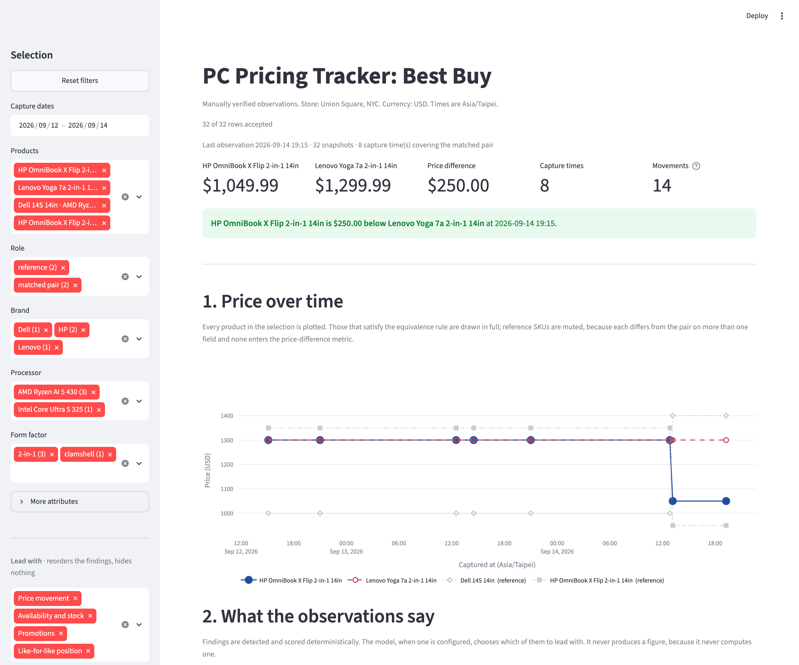

# PC Pricing Tracker (Best Buy)

Tracks the listed price of four comparable 14-inch Windows Copilot+ PCs on Best Buy and compares the two that match on a stated equivalence rule. The question is narrow on purpose: where does one SKU sit against a like-for-like competitor, and is that position moving.

Prices are recorded by hand into an append-only CSV. Every page load rebuilds an in-memory SQLite database from it, and the schema is what refuses a bad row.

The reasoning behind the product choice, the equivalence rule, the assumptions and the limitations is in the two-page written explanation, submitted alongside this repository rather than committed to it. This file is what the system is and how to run it.

## Reviewer quick start

```bash
uv sync
uv run streamlit run tracker/app.py
```

**No API key, no LLM endpoint, no database and no environment variable is required.** Every section of the dashboard renders deterministically without one.

Without `uv`, the standard Python path works too:

```bash
python -m venv .venv
source .venv/bin/activate        # Windows: .venv\Scripts\Activate.ps1
pip install -e .
streamlit run tracker/app.py
```



## Running the rest

Python 3.10 or newer.

```bash
uv run pytest                           # 296 tests, none reaching the network
```

Two optional buttons on the page call a language model. Without an endpoint they are disabled and name the variable that is missing, which is the expected state rather than a failure. To enable them, fill in `.env` and export it, because nothing here reads `.env` for you:

```bash
set -a; source .env; set +a
uv run streamlit run tracker/app.py
```

`tracker/extract.py` is an offline extraction run, not part of the page:

```bash
set -a; source .env; set +a
uv run python -m tracker.extract
```

## Adding an observation

No code change is needed.

1. Open each `source_url` from `products.csv`, store still set to Union Square, NYC.
2. Record seven structured fields per SKU into `prices_manual.csv`, plus an optional free-text note, with `captured_at_local` as `YYYY-MM-DDTHH:MM` in Asia/Taipei.
3. Reload the page. The loader is deliberately not cached, so it reflects the file.

| Field | What it is |
|---|---|
| `price` | The clearly labelled purchase price. Not the largest number on the page, not a monthly financing figure, not a comparison value, not an open-box range |
| `regular_price` | The struck-through or comparison price, blank when there is no promotion |
| `savings` | The stated saving, blank when there is none |
| `availability` | `Add to cart`, `Unavailable` or `Sold Out` |
| `seller` | The "Sold by" text |
| `stock_hint` | The stock note as written, blank if none |
| `pickup_eta` | `today`, or a date like `2026-09-18`. `today` is a state, not the capture date |
| `note` | Optional free text: promotion expiry or countdown, page badges, shipping context. Not a structured field and not watched by the change detector, but `insights.py` reads a stated promotion end date out of it |

If a field is not shown, leave it blank. Never guess.

A row the schema refuses (unknown SKU, duplicate capture time, a seller other than Best Buy, a purchasable listing with no price, savings that do not reconcile) appears at the top of the page with its CSV line number and the database's own reason. It is left in the file untouched, and the rest of the data still loads.

## How it works

```
capture.py            a person reads each product page and types what it says.
  or bestbuy.py       One capture session, one timestamp, every SKU in it.
      |               bestbuy.py is the same job from the API, not integrated.
      v
prices_manual.csv     The system of record. Append only. Its git diff is the
      |               audit trail, which is why nothing writes past it.
      v
store.py              Rebuilt in memory on every page load, never persisted.
      |               The schema refuses a bad row; two triggers refuse a
      |               matched pair that does not satisfy the equivalence rule.
      v
metrics.py            Every figure the page shows, computed from DataFrames.
insights.py           No file, no network, no model. Same input, same output.
      |
      v
app.py                One selection, applied once, binding every section.
```

The point of the shape is that the answer is computed before anything is said about it. A language model is offered three jobs and none of them is arithmetic:

| Where | What it does | What bounds it |
|---|---|---|
| `extract.py` | reads a raw spec block into twelve fields | a Pydantic schema that forbids unexpected keys, deterministic validators, and a score against the hand-verified master. It can never write to that master |
| `insights.select_with_model` | returns the indices of the findings to lead with | it is handed finished sentences and asked only for integers, so it cannot state a figure. One bad index discards the whole reply |
| `summarise.summarise` | writes at most 150 words from the computed values | every number in the reply must appear in those values or the whole summary is thrown away, retried once, then replaced by a deterministic one |

None of the three runs on page load, and the dashboard is complete without any of them.

What that does **not** buy: the grounding check tests numeric tokens only, so a figure attached to the wrong product, a wrong unit, or a sentence with no figure at all passes it. The docstring on `verify_grounded` says so in full.

## Layout

```
tracker/
  app.py          Streamlit. The only module that imports streamlit
  store.py        SQLite schema, ingest, queries. The only module that knows storage
  metrics.py      Pure functions over DataFrames. No streamlit, no path, no network
  insights.py     Scope, deterministic change detection, scoring, reading order
  summarise.py    Summary context, prose generation, grounding check
  extract.py      Offline specification extraction, scored against the master
  capture.py      Prompts for a capture session and appends it
  bestbuy.py      Products API adapter. Not integrated, not live-tested, and
                  fails closed: it supplies no value the API did not give it
data/
  structured/
    products.csv          Product master, verified by hand
    prices_manual.csv     Append-only landing file, one row per SKU per capture
  raw_specs/            Verbatim page text, the input to extraction. Not
                        published here; raw_specs/README.md says why and how
                        to recreate it
  extraction_review.<model>.csv
                        Extraction scored field by field against the master.
                        The model is in the name so a second run adds a file
                        rather than overwriting the first
  summary.md              Stored dashboard summary, written only by
                        `python -m tracker.summarise`. Absent until then,
                        and the page computes its own instead
tests/                    One file per module
```

For the manual capture and dashboard path, adding a column to either CSV needs no code change: the store carries columns the schema does not name, the sidebar grows a filter for any column the products disagree about, and the change detector watches it from its first change.

The API adapter is deliberately stricter, and the difference is the point. It refuses to append until it can fill every column the landing file records, so a column it cannot map blocks it rather than landing as a blank. Two do today: `pickup_eta` needs a store-availability call it constructs but does not execute, and `seller` has no documented product attribute that verifies first-party against marketplace.
